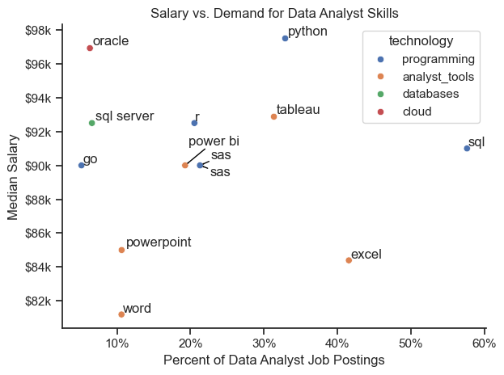

# The Analysis

## 1. What are the most demanded skills for the top 3 most popular data roles?

To determine the most in-demand skills for the top 3 data roles, I identified the top 3 roles by US job posting counts. Then, for each skill, I calculated the percentage of job postings that require that skill (done for each of the top 3 roles).

View my notebook with detailed steps here:
[2_Skills_Count.ipynb](3_Project/2_Skills_Count.ipynb)

### Code for Visualizing the Data

```python
sns.set_theme(style = 'ticks')
fig, ax = plt.subplots(len(job_titles), 1)

for i, job_title in enumerate(job_titles):
    df_plot = df_skills_perc[df_skills_perc['job_title_short'] == job_title].head(5)
    sns.barplot(data = df_plot, x = 'skill_percent', y = 'job_skills', ax = ax[i], hue = 'skill_percent', palette = 'dark:b_r')
    ax[i].set_ylabel('')
    ax[i].set_xlabel('')
    ax[i].legend().set_visible(False)
    ax[i].set_xlim(0, 80)

    for n, v in enumerate(df_plot['skill_percent']):
        ax[i].text(v + 1, n, f'{v:.0f}%', va = 'center')
    
    if i < len(job_titles) - 1:
        ax[i].set_xticks([])

ax[2].set_xlabel('Percent of Jobs Requiring the Skill')

fig.suptitle('Top 5 Highest Demand Skills by Job Title', fontsize = 15)
fig.tight_layout()
```

### Results


### Insights

SQL is the most in-demand skills for data analysts and data engineers, while python is the most in-demand for data scientists. Data engineer positions also have high demand for python. There is far less demand for python for data analyst positions.

## 2. How are the most in-demand skills for data analyst jobs trending?

To determine trends in high-demand skills for data analyst jobs, I calculated the percentage of data analyst jobs requiring each skill by month. Then, for the top 5 most demanded skills, I plotted the percentages by month to show the trend across the last year.

View my notebook with detailed steps here:
[3_Skills_Trend.ipynb](3_Project/3_Skills_Trend.ipynb)

### Code for Visualizing the Data

```python
sns.set_theme(style = 'ticks')
sns.lineplot(data = df_plot, dashes = False, palette = 'tab10')
sns.despine()
plt.title('Trend of Data Analyst Skill Demand')
plt.xlabel('Month')
plt.ylabel('Percent of Jobs Requiring Skill')
plt.legend().remove()

for i in range(5):
    plt.text(12, df_plot.iloc[-2, i], df_plot.columns[i])

from matplotlib.ticker import PercentFormatter
ax = plt.gca()
ax.yaxis.set_major_formatter(PercentFormatter(decimals = 0))

plt.show()
```
### Results


### Insights

SQL is consistently the most demanded skill across this 12 month period, however, the demand appears to be declining. SQL was required for approximately 54% of data analyst jobs in January, and this declined to about 46% in December. Excel is the second most demanded skill, but its demand also appears to be declining slightly (approximately 42% in January to 38% in December). Tableau, Python, and SAS are less demanded skills in general, but the demand for these skills appears more consistent across this 12 month period compared to SQL and Excel.

## 3. How well do data roles and associated skills pay?

To determine pay for the most popular data roles, I created boxplots of the annual salaries for the top 6 most frequent data roles. Next, I further analyzed pay for skills specific to data analyst roles. I calculated and plotted the median annual salaries for the top 10 highest paying skills, as well as the top 10 most in-demand skills.

View my notebook with detailed steps here:
[4_Salary_Analysis.ipynb.ipynb](3_Project/4_Salary_Analysis.ipynb)

### Boxplots of Salaries

#### Visualization Code

```python
sns.boxplot(data = df_US_top6, x  ='salary_year_avg', y = 'job_title_short', order = job_order)
plt.title('Boxplots of Job Salaries')
plt.xlabel('Salary')
plt.ylabel('Job Title')
plt.xlim(0, 600000)
ax = plt.gca()
ax.xaxis.set_major_formatter(plt.FuncFormatter(lambda x, _: f'${int(x/1000)}K'))
plt.show()
```
#### Results


#### Insights

Senior data scientist and engineer positions are the highest paying roles with annual salaries near $150k. The corresponding non-senior positions pay less, with median salaries of approximately $125k for non-senior data scientists and engineers. Data analyst positions (both senior and non-senior) pay the least of these data roles, with the median annual salary of non-senior data analysts being less than $100k.

### Bar Charts of Pay by Skill for Data Analyst Roles

#### Visualization Code

```python
fig, ax = plt.subplots(2, 1)

sns.set_theme(style = 'ticks')

sns.barplot(data = df_DA_top_pay, x = 'median', y = df_DA_top_pay.index, ax = ax[0], hue = 'median', palette = 'dark:b_r')
ax[0].set_xlim(0, 200000)
ax[0].xaxis.set_major_formatter(plt.FuncFormatter(lambda x, _: f'${int(x/1000)}K'))
ax[0].set_xlabel('')
ax[0].set_ylabel('')
ax[0].set_title('Highest Paid Job Skills for Data Analysts')
ax[0].legend().remove()

sns.barplot(data = df_DA_skills, x = 'median', y = df_DA_skills.index, ax = ax[1], hue = 'median', palette = 'light:b')
ax[1].set_xlim(0, 200000)
ax[1].xaxis.set_major_formatter(plt.FuncFormatter(lambda x, _: f'${int(x/1000)}K'))
ax[1].set_xlabel('Median Salary USD')
ax[1].set_ylabel('')
ax[1].set_title('Median Salary for Most Frequent Data Analyst Skills')
ax[1].legend().remove()

fig.tight_layout()
plt.show()
```
#### Results


#### Insights

The highest paying skills include things such as dplyr, bitbucket, and gitlab. However, it is worth noting that data analyst jobs requiring these skills are very rare (e.g., there were only 2 total job postings requiring dplyr). So the very highest paying skills are not very typical for data analyst positions. If we examine the pay for the most popular (frequent) skills for data analyst jobs, we see that Python, Tableau, R, and SQL pay the most, and Microsoft Office skills like PowerPoint, Excel, and Word pay less.

## 4. What are the most optimal skills for a data analyst to have based on pay and demand?

To determine the most optimal skills for data analyst to have, I plotted the median annual salary for skills against their demand (percentage of data analyst jobs requiring the skill.

View my notebook with detailed steps here:
[5_Optimal_Skills.ipynb](3_Project/5_Optimal_Skills.ipynb)

### Code for Visualizing the Data

```python
sns.set_theme(style = 'ticks')
sns.scatterplot(
    data = df_plot,
    x = 'skill_percent',
    y = 'median_salary',
    hue = 'technology'
)
plt.title('Salary vs. Demand for Data Analyst Skills')
plt.xlabel('Percent of Data Analyst Job Postings')
plt.ylabel('Median Salary')
sns.despine()

texts = []
for i, txt in enumerate(df_plot['skills']):
    texts.append(plt.text(df_plot['skill_percent'].iloc[i],
            df_plot['median_salary'].iloc[i],
            txt))

adjust_text(
    texts,
    arrowprops = dict(arrowstyle = '->', color = 'black', lw = 1)
    )

ax = plt.gca()
ax.yaxis.set_major_formatter(plt.FuncFormatter(lambda y, pos: f'${int(y / 1000)}k'))
ax.xaxis.set_major_formatter(PercentFormatter(decimals = 0))

plt.tight_layout()
plt.show()
```
### Results



### Insights

Skills with both high pay and high demand should be the most optimal skills to have. These appear in the upper right corner of the plot. The plot shows that Python, Tableau, and SQL have high pay and high demand. Based on the technology type, programming languages tend to be the most optimal to have compared to other technology types. Database and cloud technologies (i.e., Oracle and SQL server) pay well but have relatively low demand. Microsoft Office tools like Word, PowerPoint, and Excel pay the lowest, and Word and Powerpoint specifically have low demand as well.